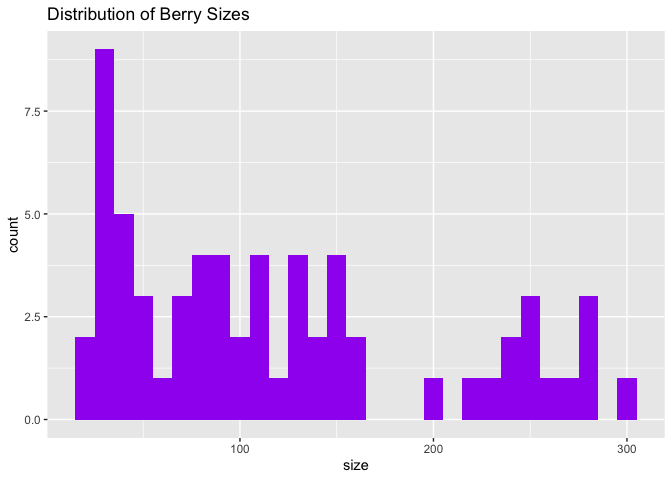
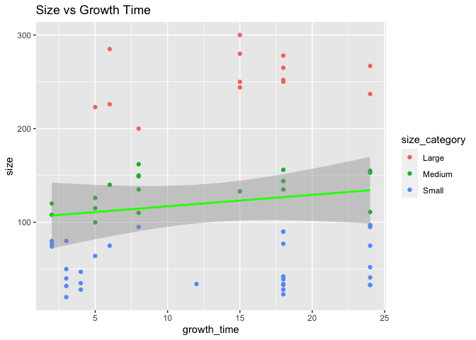
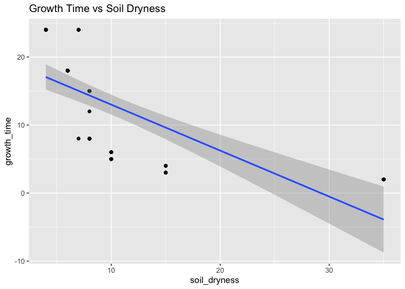
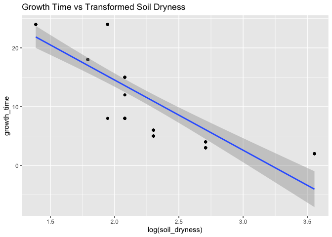
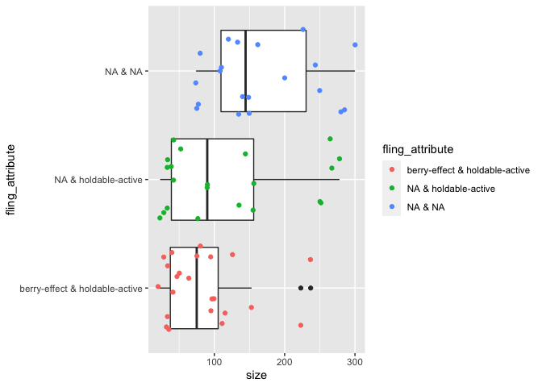
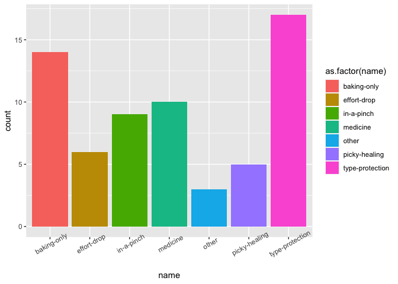

Vignette
================
Ilana Feldman
10/3/2021

## Setup

Before creating all my functions, I’ll keep a code chunk here that keeps
track of my libraries and base value.

``` r
library(httr)
library(jsonlite)
library(tidyverse)
library(purrr)
base <- "https://pokeapi.co/api/v2/"
```

In general, all of my endpoint functions build their URLs in the same
way, so, as a good programming practice, it’s appropriate to simply have
it call a function instead of tracking down and pasting the same
spread-out lines of code each time. Something that’s worth noting is
that if you have “encounter-method/?limit=5\&offset=3/2”, this just
ignores the 2 at the end, and if you have
“encounter-method/2?limit=5\&offset=3”, this just ignores everything
after the 2, since it has a specific ID. I could take this either way,
but I should probably prioritize the ID. I’ll also return a warning if
you try to put an ID + limit or ID + offset.

``` r
URLtoData <- function(id = NULL, limit = NULL, offset = NULL, endpoint) {
  if (is.null(id) == FALSE) {
    call <- paste0(base, endpoint, id)
    if(!is.null(limit) | !is.null(offset)) {
      warning("Combined ID with limit/offset. Ignoring the latter.")
    }
  } else {
    call <- paste0(base, endpoint, "?limit=", limit, "&offset=", offset)
  }
  Data <- fromJSON(call)
  return(Data)
}
```

## Endpoint Functions

### Initial Foray

I’ll be starting off with the encounter methods, although this doesn’t
have much statistical application, just to make sure that things are
working properly. I’ve also added an `alldata` argument, if limit/offset
are used, to dig a level deeper and return the individual pieces of
information on each of the entries, and a `language` argument to filter
by language.

``` r
EncounterMethod <- function(id = NULL, limit = NULL, offset = NULL, alldata = FALSE, language = NULL) {
Data <- URLtoData(id, limit, offset, endpoint = "encounter-method/")  
  if (!is.null(id)) {
    DataRefined <- Data$names %>% mutate(order = Data$order)
    
    # Checks for language
    if(!is.null(language)) {
      if(toupper(language) %in% c("EN", "ENGLISH")) {
        DataRefined <- DataRefined %>% filter(language$name == "en")
      } else if (toupper(language) %in% c("DE", "GERMAN")) {
        DataRefined <- DataRefined %>% filter(language$name == "de")
      } else {stop("Language not identified in this database.")}
    }
  }
  
  # If there isn't an ID, a limit and offset are used.
  # This is set up so that either or both can be left blank.
  else {
    # If alldata is TRUE, then we need to do a deeper dive, using purrr::map to query everything one level further in, and then sort out the data we want. In this case, that's just the names.
    if (alldata == FALSE) {
      DataRefined <- Data$results
    } else{ 
      AllData <- map(Data$results$url, fromJSON)
      DataRefined <- NULL
      for (i in 1:length(AllData)) {
        DataRefined <- DataRefined %>% bind_rows(AllData[[i]]$names)
      }
    
      # Check for language, as in the case with the ID input.
      if(!is.null(language)) {
        if(toupper(language) %in% c("EN", "ENGLISH")) {
          DataRefined <- DataRefined %>% filter(language$name == "en")
        } else if (toupper(language) %in% c("DE", "GERMAN")) {
          DataRefined <- DataRefined %>% filter(language$name == "de")
        } else {stop("Language not identified in this database.")}
      }
    }
  }
  return(DataRefined)
}
```

The following is a function call that will grab every single encounter
method in English and put it into a neat, orderly tibble. I have already
run this and stored the data, so in general, I won’t be evaluating these
since they make a large number of requests to the API.

``` r
AllEncounterMethods <- EncounterMethod(limit = 27, alldata = TRUE, language = "English")
```

### Gathering Berry Information

Getting into the main focus of what I’ll be analyzing, I’ll be making
functions that call various information about berries. This is where
things get significantly more complicated than EncounterMethods, since
there are a wide variety of helpful values here that are worth looking
further into. I’ll also want to allow the user to select specific
columns without having to guess exactly how they’re formatted.

``` r
BerryFlavor <- function(id = NULL, limit = NULL, offset = NULL, alldata = FALSE) {
  Data <- URLtoData(id, limit, offset, endpoint = "berry-flavor/")
  if (!is.null(id)) {
    RefinedData <- Data$berries
  }
  
  else {
    if (alldata == FALSE) {
      RefinedData <- Data$results
    }
    else {
      Data <- map(Data$results$url, fromJSON)
      RefinedData <- NULL

      for(i in 1:length(Data)) {
        RefinedData <- RefinedData %>% bind_rows(cbind("flavor" = Data[[i]]$name, Data[[i]]$berries))
      }
    }
  }
  return(RefinedData)
}
```

In case I need it, I’ll be pulling information from all 6 endpoints. The
ones I use will be stored in CSV files.

``` r
AllBerryFlavors <- BerryFlavor(limit = 5, alldata = TRUE)
```

Moving onto some of the more complex endpoints: I wanted to examine the
information on berries, which requires me to connect to the Berry
endpoint, but there are other endpoints that contain more subtle
information on berries as well.

In order to make things a little easier for the user, I’ve included a
function that allows you to pick specific columns, without necessarily
getting the exact name of the column right. Specifically, I made it so
that spaces and symbols aren’t needed, and there are multiple keywords
you can type in to get the desired column for many of the columns.

``` r
BerryFilter <- function(berryoutput, colfilter) {
  # The idea is to run (matrix of possible values) %in% colfilter
  # Then whichever columns have a TRUE value get used in select().
  BerryLegalValues <- matrix(c("id", NA, NA,
                          "firmness", "firm", NA,
                          "flavor", "flavors", NA,
                          "potency", NA, NA,
                          "growthtime", "growth", "time",
                          "item", "items", NA,
                          "maxharvest", "harvest", NA,
                          "name", "names", NA,
                          "naturalgiftpower", "giftpower", "power",
                          "naturalgifttype", "gifttype", "type",
                          "size", "sizes", NA,
                          "smoothness", "smooth", NA,
                          "soildryness", "soil", "dryness"), nrow = 3)
  MatchLegalValues <- matrix(BerryLegalValues %in% tolower(str_replace_all(colfilter,"[^[:alnum:]]",
                             "")), nrow = 3)
  SelectedCols <- numeric()
  for(i in 1:ncol(BerryLegalValues)) {
    if (any(MatchLegalValues[,i])) {
      SelectedCols <- c(SelectedCols, i)
    }
  }
  return(select(berryoutput, all_of(SelectedCols)))
}

# As for the function that will call from this endpoint:
Berry <- function(id = NULL, limit = NULL, offset = NULL, alldata = FALSE, colfilter = NULL) {
  Data <- URLtoData(id, limit, offset, endpoint = "berry/")
  if (!is.null(id)) {
    # I do some mildly funky stuff here to get R to cooperate and get the list returned from fromJSON
    # into an orderly data frame.
    BerryTibble <- read_csv("\n", col_names = names(Data))
    BerryTibble[1:5,] <- NA
    for (i in 1:ncol(BerryTibble)){
      BerryTibble[,i] <- Data[[i]][1]
    }
    CompleteData <- BerryTibble %>% mutate(potency = Data[2]$flavors$potency) %>% relocate(potency,
                                   .before = growth_time) %>% relocate(id, .before = firmness)
    if (is.null(colfilter)) {
      RefinedData <- CompleteData
    } else {
      RefinedData <- BerryFilter(CompleteData, colfilter)
    }
  }
  # If colfilter isn't NULL, CompleteData will be filtered out into RefinedData towards the end.
  
  # Things do get more complicated if we have limit+offset and alldata = TRUE.
  # In that case, I'll just run a for() loop, since this isn't an incredibly time intensive task,
  # to get each individual berry in order.
  else {
    if (alldata == FALSE) {
      RefinedData <- Data$results
    }
    else {
      Data <- map(Data$results$url, fromJSON)
      CompleteData <- NULL

      for(i in 1:length(Data)) {
        TempTibble <- read_csv("\n", col_names = names(Data[[i]]), show_col_types = FALSE)
        TempTibble[1:5,] <- NA
        for (j in 1:ncol(TempTibble)){
          TempTibble[,j] <- Data[[i]][[names(Data[[i]])[j]]][1]
        }
        TempTibble <- TempTibble %>% mutate(potency = Data[[i]]$flavors$potency) %>%
          relocate(potency, .before = growth_time) %>% relocate(id, .before = firmness)
        CompleteData <- CompleteData %>% bind_rows(TempTibble)
      }
      if (is.null(colfilter)) {
        RefinedData <- CompleteData
      } else {
        RefinedData <- BerryFilter(CompleteData, colfilter)
      }
    }
  }
  return(RefinedData)
}
```

With the relevant berry endpoint functions created, I can now pull all
of the Berry information and filter it by the columns that I may be
interested in for my statistical analysis. Since I’m removing the flavor
columns, I can use `dplyr::distinct` to reduce this down from 320 to 64
rows.

``` r
AllBerries <- distinct(Berry(limit = 64, alldata = TRUE, colfilter = c("id", "growthtime", "maxharvest", "item", "naturalgiftpower", "naturalgifttype", "size", "smoothness", "soildryness")))
write_csv(AllBerries, "Berries.csv")
```

### Comparing Berries in the Context of Items

The remaining endpoints will be various subsets of items, which I’ll use
to divide up the berries into various types for statistical analysis. As
before, I’ll include a function/input that allows you to filter out
specific columns when appropriate. All three of these appear to filter
berries into different categories in different ways, which may be
interesting to examine.

``` r
ItemCatFilter <- function(itemcatoutput, colfilter) {
  # This function is essentially the same as for filtering Berry, but with different values.
    ItemCatLegalValues <- matrix(c("id", NA, NA,
                          "item", "items", NA,
                          "url", "itemurl", "itemsurl",
                          "name", NA, NA,
                          "names", NA, NA,
                          "pocket", "pockettype", "type"), nrow = 3)
  MatchLegalValues <- matrix(ItemCatLegalValues %in% tolower(str_replace_all(colfilter,"[^[:alnum:]]",
                             "")), nrow = 3)
  SelectedCols <- numeric()
  for(i in 1:ncol(ItemCatLegalValues)) {
    if (any(MatchLegalValues[,i])) {
      SelectedCols <- c(SelectedCols, i)
    }
  }
  return(select(itemcatoutput, all_of(SelectedCols)))
}

ItemCategory <- function(id = NULL, limit = NULL, offset = NULL, alldata = FALSE, colfilter = NULL) {
  Data <- URLtoData(id, limit, offset, endpoint = "item-category/")
  if (!is.null(id)) {
    RefinedData <- cbind("pocket$name" = Data$pocket$name, Data$items)
    }
  
  else {
    if (alldata == FALSE) {
      RefinedData <- Data$results
    }
    else {
      Data <- map(Data$results$url, fromJSON)
      CompleteData <- NULL

      for(i in 1:length(Data)) {
        TempTibble <- read_csv("\n", col_names = names(Data[[i]]), show_col_types = FALSE)
        TempTibble[1:nrow(Data[[i]][[names(Data[[i]])[2]]]),] <- NA
        # This is modified from the Berry function because the number of items in 
        # this category changes, whereas it was constant in Berry.
        
        for (j in 1:ncol(TempTibble)){
          TempTibble[,j] <- Data[[i]][[names(Data[[i]])[j]]][1]
        }
        # This unfortunately leaves out items$url, which can actually be helpful, so I'll add it in.
        TempTibble <- TempTibble %>% add_column(Data[[i]][[names(Data[[i]])[2]]][2], .after = "items")
        CompleteData <- CompleteData %>% bind_rows(TempTibble)
      }
      if (is.null(colfilter)) {
        RefinedData <- CompleteData
      } else {
        RefinedData <- ItemCatFilter(CompleteData, colfilter)
      }
    }
  }
  return(RefinedData)
}
```

I’m assuming that all items in the API can be found in one of the item
categories. Since the information from `berry/` comes with item names
that match up to the item names in the categories, I can do an inner
join to get that information in one table. Then, I can compare various
metrics of the berries in the context of whichever category they’re in.

``` r
AllItemCategories <- ItemCategory(limit = 45, alldata = TRUE, colfilter = c("id", "items", "url", "name", "pocket"))
write_csv(AllItemCategories, "ItemCategories.csv")
```

It’s worth noting that doing this gets a list of all items, just grouped
by category. If we wanted to, we could get a similar list without the
category grouping by calling
`https://pokeapi.co/api/v2/item/?limit=954`. However, this wouldn’t be
particularly useful without going a level deeper, which would require
making 954 additional calls for a massive amount of data which is mostly
uninteresting in the context of the statistical analysis I have planned.

The remaining endpoints more or less follow a similar line of attack
compared to the previous ones.

``` r
ItemAttrFilter <- function(itemattroutput, colfilter) {
    ItemAttrLegalValues <- matrix(c("desc", "descriptions", "description",
                          "id", NA, NA,
                          "items", "item", NA,
                          "name", NA, NA,
                          "names", NA, NA), nrow = 3)
  MatchLegalValues <- matrix(ItemAttrLegalValues %in% tolower(str_replace_all(colfilter,"[^[:alnum:]]",
                             "")), nrow = 3)
  SelectedCols <- numeric()
  for(i in 1:ncol(ItemAttrLegalValues)) {
    if (any(MatchLegalValues[,i])) {
      SelectedCols <- c(SelectedCols, i)
    }
  }
  return(select(itemattroutput, all_of(SelectedCols)))
}

ItemAttribute <- function(id = NULL, limit = NULL, offset = NULL, alldata = FALSE, colfilter = NULL) {
  Data <- URLtoData(id, limit, offset, endpoint = "item-attribute/")
  if (!is.null(id)) {
    RefinedData <- list(Data$name, Data$items)
  }
  else {
    if(alldata == FALSE) {
      RefinedData <- Data$results
    } else {
      Data <- map(Data$results$url, fromJSON)
      CompleteData <- NULL

      for(i in 1:length(Data)) {
        TempTibble <- read_csv("\n", col_names = names(Data[[i]]), show_col_types = FALSE)
        # Due to a plethora of errors resulting from one of the item lists being empty,
        # I've instructed it to simply skip those, since that information can be found with id = # regardless.
        if(!is.null(nrow(Data[[i]][[names(Data[[i]])[3]]]))) {
          TempTibble[1:max(nrow(Data[[i]][[names(Data[[i]])[3]]]),1),] <- NA

          for (j in 1:ncol(TempTibble)){
            TempTibble[,j] <- Data[[i]][[names(Data[[i]])[j]]][1]
          }
          CompleteData <- CompleteData %>% bind_rows(TempTibble)
        }
      }
      if (is.null(colfilter)) {
        RefinedData <- CompleteData
      } else {
        RefinedData <- ItemAttrFilter(CompleteData, colfilter)
      }      
    }
  }
  return(RefinedData)
}
```

``` r
AllItemAttributes <- ItemAttribute(limit = 8, alldata = TRUE, colfilter = c("desc", "id", "items", "name"))
write_csv(AllItemAttributes, "ItemAttributes.csv")
```

``` r
ItemFlingFilter <- function(itemflingoutput, colfilter) {
    ItemFlingLegalValues <- matrix(c("effectentries", "effect", "effectentry",
                          "id", NA, NA,
                          "items", "item", NA,
                          "name", "names", NA), nrow = 3)
  MatchLegalValues <- matrix(ItemFlingLegalValues %in% tolower(str_replace_all(colfilter,"[^[:alnum:]]",
                             "")), nrow = 3)
  SelectedCols <- numeric()
  for(i in 1:ncol(ItemFlingLegalValues)) {
    if (any(MatchLegalValues[,i])) {
      SelectedCols <- c(SelectedCols, i)
    }
  }
  return(select(itemflingoutput, all_of(SelectedCols)))
}


ItemFlingEffect <- function(id = NULL, limit = NULL, offset = NULL, alldata = FALSE, colfilter = NULL) {
  Data <- URLtoData(id, limit, offset, endpoint = "item-fling-effect/")
  if (!is.null(id)) {
    RefinedData <- data_frame("effectname" = Data$name, Data$effect_entries[1], "id" = Data$id, Data$items)
  }
  else {
    if(alldata == FALSE) {
      RefinedData <- Data$results
    } else {
      Data <- map(Data$results$url, fromJSON)
      CompleteData <- NULL

      for(i in 1:length(Data)) {
        TempTibble <- read_csv("\n", col_names = names(Data[[i]]), show_col_types = FALSE)
        TempTibble[1:nrow(Data[[i]][[names(Data[[i]])[3]]]),] <- NA

        for (j in 1:ncol(TempTibble)){
          TempTibble[,j] <- Data[[i]][[names(Data[[i]])[j]]][1]
        }
        CompleteData <- CompleteData %>% bind_rows(TempTibble)
      }
      if (is.null(colfilter)) {
        RefinedData <- CompleteData
      } else {
        RefinedData <- ItemFlingFilter(CompleteData, colfilter)
      }
    }
  }
  return(RefinedData)
}
```

``` r
AllItemFlingEffects <- ItemFlingEffect(limit = 7, alldata = TRUE)
write_csv(AllItemFlingEffects, "ItemFlingEffects.csv")
```

## Exploratory Data Analysis

I’ll be exploring the various attributes of berries based on the item
categories they fall into and how they operate as items in general.
Since I’m not running the Endpoint\#Data chunks while knitting this,
I’ll need to collect the data from the .csv sheets that I set up.

``` r
AllBerries <- read_csv("Berries.csv")
AllItemCategories <- read_csv("ItemCategories.csv")
AllItemAttributes <- read_csv("ItemAttributes.csv")
AllItemFlingEffects <- read_csv("ItemFlingEffects.csv")
```

Before I start cross-analyzing the berries by item categories, however,
approximately how are the berry sizes distributed? There can be,
potentially, a wide variety of berry sizes, or a few, and they could be
uniform, normal, or any other distribution.

``` r
gBerry1 <- ggplot(AllBerries)
gBerry1 + geom_histogram(aes(x = size), fill = "purple", binwidth = 10) + ggtitle("Distribution of Berry Sizes")
```

<!-- -->

We can see that there are a fairly wide variety of sizes, and they are
generally skewed to the right. It looks like Berries could be divided
into different size categories. I’ll divide them into “small”, “medium”,
and “large” categories to analyze further down the line.

``` r
AllBerries <- AllBerries %>% mutate(size_category = if_else(size < 100, "Small",
                                                            if_else(size < 200, "Medium", "Large")))
```

I’m also interested in how growth time affects or is affected by other
attributes of the berries. Specifically, is the berry size influenced by
its growth time, and is there a relationship between the soil dryness
and the growth time?

``` r
gBerry1 + geom_point(aes(x = growth_time, y = size, color = size_category)) + geom_smooth(aes(x = growth_time, y = size), method = lm, col = "Green") + ggtitle("Size vs Growth Time")
```

    ## `geom_smooth()` using formula 'y ~ x'

<!-- -->

We can see in this growth time versus size plot that there doesn’t seem
to be much of a relationship between the growth time and the berry size.
Even if we sectioned it off into each of the berry size categories, it
doesn’t look like there would be a significant relationship within those
categories.

``` r
gBerry1 + geom_point(aes(x = soil_dryness, y = growth_time)) + geom_smooth(aes(x = soil_dryness, y = growth_time), method = lm) + ggtitle("Growth Time vs Soil Dryness")
```

    ## `geom_smooth()` using formula 'y ~ x'

<!-- -->

There seems to be a clear nonlinear relationship here. At very small
values of soil dryness, i.e. where the berry does not dry out the soil
very quickly, the growth time is much larger, whereas the growth time
asymptotically approaches 0 as we look at berries that dry out the soil
much more quickly. There are also very few visible data points here,
meaning that there are many berries that have the same soil dryness and
the same growth time. I’ll try to apply a logarithmic transformation to
the soil\_dryness variable to see if a linear relationship emerges.

``` r
gBerry1 + geom_point(aes(x = log(soil_dryness), y = growth_time)) + geom_smooth(aes(x = log(soil_dryness), y = growth_time), method = lm) + ggtitle("Growth Time vs Transformed Soil Dryness")
```

    ## `geom_smooth()` using formula 'y ~ x'

<!-- -->

With the logarithmic transformation, the data still does not fit
perfectly, but it is somewhat closer to a linear relationship.
Regardless, these two variables are still clearly connected in some way
due to the aforementioned overlap of data points.

Before I can plot data by item categories and other attributes, I’ll
need to perform various joins of the endpoints to connect the data
together. I’ve also created another variable that combines the fling
name and attribute name for convenience.

``` r
Berry.Category <- inner_join(AllBerries, AllItemCategories, by = c("item" = "items")) %>% select(-c("id.x", "natural_gift_type", "id.y", "url", "pocket"))
Berry.Fling.Attribute <- left_join(AllBerries, AllItemFlingEffects, by = c("item" = "items")) %>% left_join(., AllItemAttributes, by = c("item" = "items")) %>% select("item", "size", "size_category", "fling_name" = "name.x", "attribute_name" = "name.y") %>% mutate(., fling_attribute = paste(fling_name, attribute_name, sep = " & "))

unique(Berry.Fling.Attribute$fling_name)
```

    ## [1] "berry-effect" NA

``` r
unique(Berry.Fling.Attribute$attribute_name)
```

    ## [1] "holdable-active" NA

Now that I’ve made the necessary joins, I can begin to analyze the
berries by their context as items, not just as berries.

We can see that both the fling and attribute columns in
`Berry.Fling.Attribute` only have one unique name that pertains to
berries; however, it may still be interesting to see whether the berries
that have a “berry-effect” tag or “holdable-active” attribute have a
significantly different size distribution when compared to all berries.

``` r
gBerry2 <- ggplot(Berry.Fling.Attribute)
gBerry2 + geom_boxplot(aes(x = size, y = fling_attribute)) + geom_point(aes(x = size, y = fling_attribute, color = fling_attribute), position = "jitter")
```

<!-- -->

It generally appears that all of the smallest berries at least have the
holdable-active attribute, and the larger the berry is, the less likely
it is to have a fling effect and/or an item attribute.

Finally, I will analyze the berries by their item category.

``` r
gBerry3 <- ggplot(Berry.Category)
gBerry3 + geom_bar(aes(x = name, fill = as.factor(name))) + theme(axis.text.x = element_text(angle = 30))
```

<!-- -->

There are 7 different categories that berries fall into, with most of
these categories containing quite a few different berries. Only 3
berries fall into “other”, those being (via `filter(Berry.Category, name
== "other")`) the enigma, jaboca, and rowap berries. Let’s see if
there’s any meaningful difference in sizes between these categories:

``` r
Berry.Category %>% group_by(name) %>% summarize(Avg = mean(size), Sd = sd(size), Median = median(size), IQR = IQR(size))
```

    ## # A tibble: 7 × 5
    ##   name              Avg    Sd Median   IQR
    ##   <chr>           <dbl> <dbl>  <dbl> <dbl>
    ## 1 baking-only     171.   88.1  136.  162. 
    ## 2 effort-drop     151    29.9  150.   20.5
    ## 3 in-a-pinch      123.   81.7   97    78  
    ## 4 medicine         46.1  23.7   37.5  16.8
    ## 5 other            80    65.6   52    61  
    ## 6 picky-healing   126.   59.3  115    26  
    ## 7 type-protection 116.   92.7   90   117

Some clear size differences become apparent here. While the “other”
category is more susceptible to a low data size due to its nature and
high SD, we can clearly see that “medicine” berries are much smaller
than those of the other types, along with having a lower SD. The other
berries do not seem to be significantly different in size, although it
may be notable that “effort-drop” berries are usually about the same
size, whereas the other types vary more significantly.

I’ll conclude with a 3-way contingency table showing off the natural
gift power and smoothness, two variables I have not covered yet, sorted
by item category.

``` r
GiftPowerSmoothnessCat <- table(Berry.Category$natural_gift_power, Berry.Category$smoothness, Berry.Category$name)
GiftPowerSmoothnessCat
```

    ## , ,  = baking-only
    ## 
    ##     
    ##      20 25 30 35 40 50 60
    ##   60  1  0  0  0  0  0  0
    ##   70  4  0  4  2  0  0  0
    ##   80  0  0  0  3  0  0  0
    ## 
    ## , ,  = effort-drop
    ## 
    ##     
    ##      20 25 30 35 40 50 60
    ##   60  0  0  0  0  0  0  0
    ##   70  5  0  1  0  0  0  0
    ##   80  0  0  0  0  0  0  0
    ## 
    ## , ,  = in-a-pinch
    ## 
    ##     
    ##      20 25 30 35 40 50 60
    ##   60  0  0  0  0  0  0  0
    ##   70  0  0  0  0  0  0  0
    ##   80  0  0  0  0  5  2  2
    ## 
    ## , ,  = medicine
    ## 
    ##     
    ##      20 25 30 35 40 50 60
    ##   60  5  5  0  0  0  0  0
    ##   70  0  0  0  0  0  0  0
    ##   80  0  0  0  0  0  0  0
    ## 
    ## , ,  = other
    ## 
    ##     
    ##      20 25 30 35 40 50 60
    ##   60  0  0  0  0  0  0  0
    ##   70  0  0  0  0  0  0  0
    ##   80  0  0  0  0  0  0  3
    ## 
    ## , ,  = picky-healing
    ## 
    ##     
    ##      20 25 30 35 40 50 60
    ##   60  0  5  0  0  0  0  0
    ##   70  0  0  0  0  0  0  0
    ##   80  0  0  0  0  0  0  0
    ## 
    ## , ,  = type-protection
    ## 
    ##     
    ##      20 25 30 35 40 50 60
    ##   60  0  0 10  7  0  0  0
    ##   70  0  0  0  0  0  0  0
    ##   80  0  0  0  0  0  0  0

While there is a lot of empty space on these tables, due to spreading 64
berries across 149 potential values, this actually reveals a lot of
similarity in the smoothness and natural gift power between berries of
the same item category. Other than the berries in the baking-only
category, they all have the same natural gift power within a category,
and generally similar or the same smoothness.
